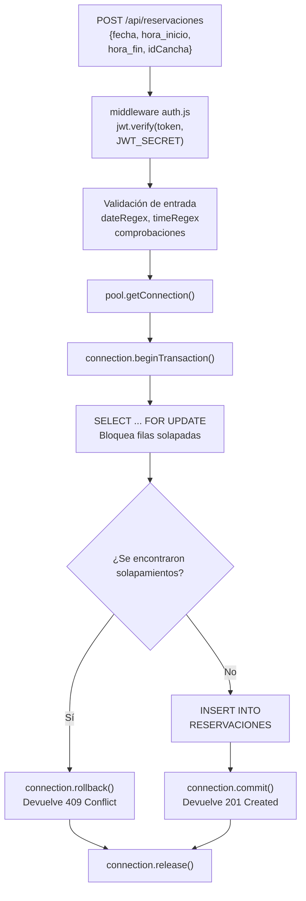
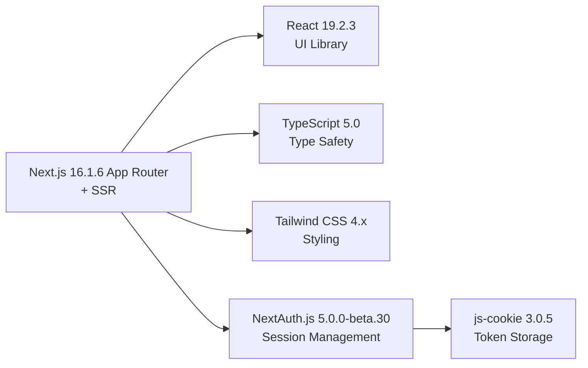
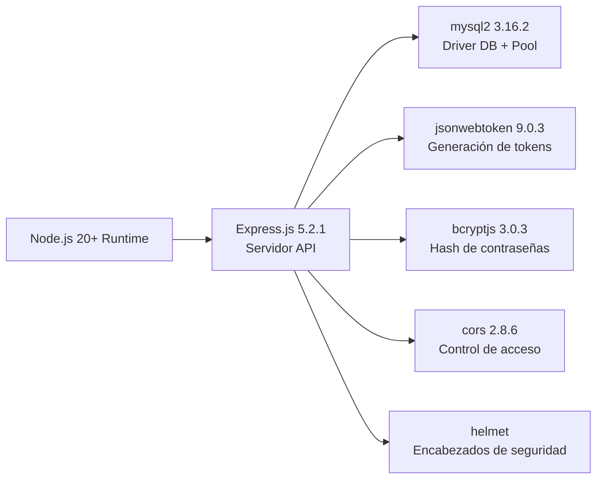
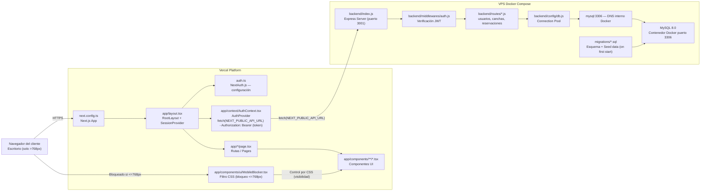

# 🎾 A La Reja - Sistema de Reservación de Canchas de Pádel

<div align="center">

[](https://a-la-reja.vercel.app/)

**🌐 Live Demo:** [**https://a-la-reja.vercel.app/**](https://a-la-reja.vercel.app/)


**Estado del Proyecto:** 🚀 En Producción

</div>

---

## Tabla de Contenidos

- [Descripción](#descripción)
- [Primeros pasos](#primeros-pasos)
- [Arquitectura del sistema](#arquitectura-del-sistema)
  - [Arquitectura de seguridad](#arquitectura-de-seguridad)
  - [Arquitectura de despliegue](#arquitectura-de-despliegue)
- [Aplicación Frontend](#aplicacion-frontend)
  - [Autenticación (Frontend)](#autenticacion-frontend)
  - [Sistema de bloqueo móvil](#sistema-de-bloqueo-movil)
  - [Componentes UI y sistema de diseño](#componentes-ui-y-sistema-de-diseno)
  - [Páginas y flujos de usuario](#paginas-y-flujos-de-usuario)
  - [Interfaz de administración](#interfaz-de-administracion)
- [API Backend](#api-backend)
  - [Autenticación y gestión de usuarios](#autenticacion-y-gestion-de-usuarios)
  - [Sistema de reservaciones y control de concurrencia](#sistema-de-reservaciones-y-control-de-concurrencia)
  - [API de canchas](#api-de-canchas)
  - [Notificaciones por email](#notificaciones-por-email)
  - [Referencia de endpoints API](#referencia-de-endpoints-api)
  - [Manejo de errores y logging](#manejo-de-errores-y-logging)
- [Base de datos](#base-de-datos)
  - [Esquema y relaciones](#esquema-y-relaciones)
  - [Pool de conexiones y configuración](#pool-de-conexiones-y-configuracion)
  - [Migraciones de base de datos](#migraciones-de-base-de-datos)
- [Despliegue y operaciones](#despliegue-y-operaciones)
  - [Configuración de Docker](#configuracion-de-docker)
  - [Variables de entorno](#variables-de-entorno)
  - [Guía de despliegue a producción](#guia-de-despliegue-a-produccion)

## Descripción

Este documento proporciona una introducción de alto nivel a **A La Reja**, un sistema de reserva de canchas de pádel exclusivo para escritorio. Cubre el propósito del proyecto, la funcionalidad principal, el stack tecnológico y la arquitectura del sistema. Esta descripción general está destinada a desarrolladores que necesitan comprender cómo funciona el sistema a nivel conceptual antes de sumergirse en subsistemas específicos.

## ¿Qué es A La Reja?

A La Reja es una aplicación web full-stack que permite a los usuarios consultar, reservar y gestionar reservaciones de canchas de pádel. El sistema implementa una arquitectura en tres capas con **Next.js 16** (frontend), **Express.js** (API backend) y **MySQL 8.0** (base de datos). La aplicación está diseñada explícitamente para uso en escritorio; los dispositivos móviles se bloquean en puntos de interrupción de ancho ≤768px mediante media queries de CSS.

**Estado actual:** La aplicación está desplegada en producción en https://a-la-reja.vercel.app/ con funcionalidad completa para gestión de usuarios, autenticación y operaciones CRUD sobre reservaciones. El procesamiento de pagos aún no está implementado.

## Características Principales

### Gestión de Usuarios y Autenticación

El sistema implementa dos rutas de inicio de sesión separadas gestionadas completamente por `auth.ts` (el proveedor de credenciales de NextAuth.js):

| Ruta            | Quién                          | Fuente de Credenciales                            | Emisor de Token                                        |
| --------------- | ------------------------------ | ------------------------------------------------- | ------------------------------------------------------ |
| Admin           | Administrador único codificado | Variables de entorno ADMIN_EMAIL + ADMIN_PASSWORD | NextAuth mismo vía jose (HS256, JWT_SECRET)            |
| Usuario regular | Usuarios de base de datos      | Tabla USUARIOS (hash bcrypt)                      | Express POST /api/login → jsonwebtoken (JWT de 1 hora) |

La verificación de credenciales de administrador utiliza `timingSafeStringEqual()` para prevenir ataques de temporización. Los usuarios regulares son autenticados por Express, que emite su propio JWT; ese token se almacena entonces en el campo `accessToken` de la sesión de NextAuth.

#### Componentes Clave:

- NextAuth config: [auth.ts](auth.ts)
- Frontend context (cookie storage, `getAuthHeader`): [app/context/AuthContext.tsx](app/context/AuthContext.tsx)
- Session provider: [app/components/providers/SessionProvider.tsx](app/components/providers/SessionProvider.tsx)
- Route guard (role-based redirect): [middleware.ts](middleware.ts)
- Backend JWT verification: [backend/middlewares/auth.js](backend/middlewares/auth.js)
- Login/registration endpoints: [backend/routes/usuarios.js](backend/routes/usuarios.js)

### Sistema de Reservaciones con control de concurrencia

El sistema de reservaciones previene la doble reserva mediante transacciones de base de datos con bloqueo a nivel de fila.

<div align="center">



</div>

### Logica de detección de superposición:

```mysql
SELECT idReservacion
FROM RESERVACIONES
WHERE fecha = ?
  AND CANCHAS_idCancha = ?
  AND (hora_inicio < ? AND hora_fin > ?)
LIMIT 1 FOR UPDATE;
```

Esto asegura que incluso las solicitudes simultaneas no puedan reservar dos veces el mismo horario. La clausula `FOR UPDATE` bloquea las filas seleccionadas hasta que la transaccion se completa.

### Mobile Blocking System

La aplicación implementa un acceso único para dispositivos de escritorio a través de un filtro CSS:

| Componente            | Propósito                                                                                                                  |
| --------------------- | -------------------------------------------------------------------------------------------------------------------------- |
| MobileBlocker         | Muestra un mensaje bloqueado con marca en móvil [app/components/ui/MobileBlocker.tsx](app/components/ui/MobileBlocker.tsx) |
| Consulta CSS media    | @media (max-width: 768px) alterna .mobile-blocker / .desktop-content [app/globals.css](app/globals.css) (líneas 19-27)     |
| Integración en Layout | Envuelve todos los hijos de página [app/layout.tsx](app/layout.tsx) (línea 46)                                             |

A ≤768px ambas ramas del DOM siempre se renderizan; el CSS controla la visibilidad. El contenido se oculta y se muestra el mensaje bloqueado; en escritorio (>768px) ocurre lo contrario.

### Interfaz de Administrador

Una zona de administración separada es accesible solo después de iniciar sesión con las credenciales de administrador. Proporciona:

- Panel con estadísticas del sitio, un calendario interactivo por cancha con código de colores y las transacciones más recientes.
- Subpáginas para gestionar reservaciones (`/admin/reservaciones`), usuarios (`/admin/usuarios`) y canchas (`/admin/canchas`).
- Navegación mediante el componente AdminNavBar con resaltado de la ruta activa.
- Las rutas de administrador están protegidas por `middleware.ts`, que redirige las sesiones no administradoras a `/dashboard`.

## Stack Tecnológico

### Dependencias Frontend

<div align="center">



</div>

### Dependencias Backend

<div align="center">



</div>

### Componentes de la Infraestructura

| Componente     | Versión    | Despliegue        | Propósito                                   |
| -------------- | ---------- | ----------------- | ------------------------------------------- |
| Docker         | Última     | VPS               | Contenerización del backend                 |
| Docker Compose | Última     | VPS               | Orquestación de servicios (mysql + backend) |
| MySQL          | 8.0        | Contenedor Docker | Base de datos relacional                    |
| Vercel         | Plataforma | Nube              | Hosting del frontend con CDN                |

## Arquitectura del sistema

<div align="center">



</div>
